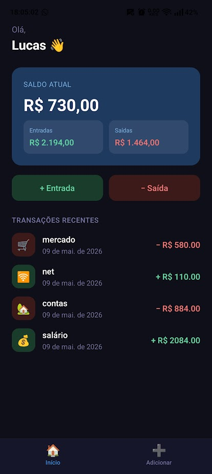
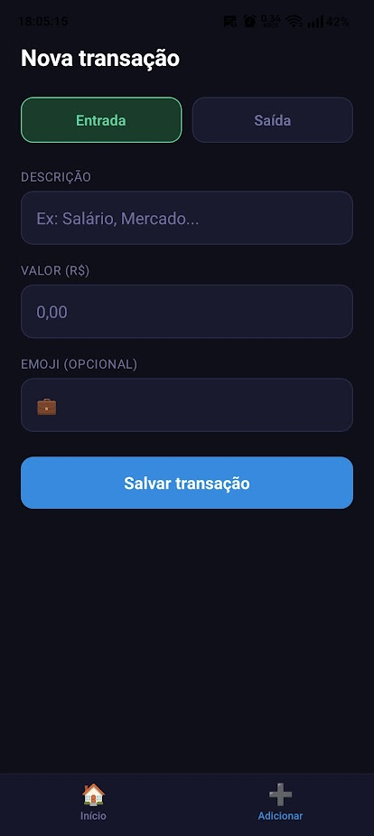

# 💰 Finanças App

App mobile de controle financeiro pessoal desenvolvido com React Native e Expo.

## 📱 Como executar o app

Clone o projeto:

```bash
git clone https://github.com/Finagoth/financas-app.git
```

Instale as dependências:

```bash
npm install
```

Execute:

```bash
npx expo start
```

Depois escaneie o QR Code usando o Expo Go.
---

## 📸 Screenshots





## 🚀 Funcionalidades

- ✅ Visualizar saldo atual com entradas e saídas
- ✅ Adicionar transações (entrada ou saída) com emoji personalizado
- ✅ Remover transações com toque longo
- ✅ Dados persistidos localmente com AsyncStorage
- ✅ Navegação entre telas com Tab Bar
- ✅ Cálculo automático de saldo em tempo real

## 🛠️ Tecnologias

- [React Native](https://reactnative.dev/)
- [Expo](https://expo.dev/)
- [TypeScript](https://www.typescriptlang.org/)
- [React Navigation](https://reactnavigation.org/)
- [AsyncStorage](https://react-native-async-storage.github.io/async-storage/)
- Context API

## 📂 Estrutura do projeto

- src/
- ├── components/     # Componentes reutilizáveis
- ├── context/        # Estado global com Context API
- ├── navigation/     # Configuração de rotas
- └── screens/        # Telas do app

## ▶️ Rodar localmente

```bash
# Instalar dependências
npm install

# Iniciar o projeto
npx expo start
```

## 👨‍💻 Autor

Lucas Calíope — [LinkedIn](https://www.linkedin.com/in/lucas-caliope09/) • [GitHub](https://github.com/Finagoth)
